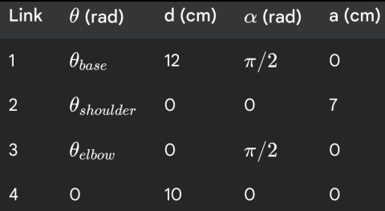

# ROS Manipulator Simulation & Control Task

## Overview

In this assignment, you are provided with the following resources for a 3-DOF robotic manipulator:

- The robot's URDF file (`urdf/robot.urdf`)
- STL mesh files for visualization and collision
- DH parameters for the manipulator (`ros_task/dh_parameters.png`)

- A set of joint angle commands (`ros_task/angles.txt`)
- Example launch files and configuration files

Your task is to **complete the ROS 2 package** so that:

1. The robot is spawned in Ignition Gazebo using its URDF and mesh files.
2. The robot is controlled by publishing joint positions read from `angles.txt`.
3. The code structure is modular and follows ROS 2 best practices.

---

## Provided Files

- **urdf/robot.urdf**: The robot's URDF description, referencing STL meshes.
- **meshes/**: STL files for each robot part.
- **ros_task/DH_parameters.txt**: The DH parameters for the manipulator (for reference).
- **ros_task/angles.txt**: Each line contains a set of joint angles (degrees) and a gripper command.
- **config/manipulator.yaml**: Controller configuration for ros2_control.
- **launch/display.launch.py**: Launches the simulation and robot spawning (incomplete, you must fill in the missing parts).
- **launch/spawn_robot.launch.py**: Launches the robot and controllers (provided for reference).
- **src/fk_task.py**: The Python node for reading angles and publishing commands (skeleton provided, you must implement).
- **CMakeLists.txt**: Build and install instructions (some install rules missing, you must complete).
- **package.xml**: ROS 2 package manifest.

---

## Solution Overview

### 1. `src/fk_task.py` Implementation

The node has been implemented with the following features:
- Reads joint angles and gripper commands from `angles.txt` using ROS 2 package share directory
- Publishes joint positions to `/forward_position_controller/commands` topic with a 1-second interval
- Implements forward kinematics using DH parameters to compute end-effector position
- Prints end-effector positions to terminal in X,Y,Z format
- Stores end-effector positions in `ros_task/end_effector.txt`
- Handles error cases and invalid angles gracefully

### 2. `launch/display.launch.py` Implementation

The launch file has been completed with:
- Environment setup for Ignition Gazebo with proper resource paths
- Launch configuration for empty world in Ignition Gazebo
- Integration with robot spawn launch file
- Proper package and resource management

### 3. `spawn_robot.launch.py`

- Remained unchanged as per requirements

---

## Implementation Status

- [x] `src/fk_task.py` is fully implemented and functional
- [x] `launch/display.launch.py` is complete and launches the simulation successfully
- [x] Robot simulation moves according to angles from `angles.txt`
- [x] End-effector positions are computed and stored in `ros_task/end_effector.txt`
- [x] Video demonstration available at: https://youtu.be/jxuYggvI_8k

---
## Installation

To get started, clone this repository into a ROS 2 workspace and build it as follows:

```bash
mkdir -p eklavya_ws/src
cd eklavya_ws/src
git clone https://github.com/NoobMaster-version/ros_task_eklavya
cd ..
colcon build
```

---

## Running the Solution

1. Build the package:
    ```
    colcon build
    source install/setup.bash
    ```
2. Launch the simulation:
    ```
    ros2 launch ros_task_eklavya display.launch.py
    ```
3. In a new terminal, run the forward kinematics node:
    ```
    ros2 run ros_task_eklavya fk_task.py
    ```

The node will:
- Read joint angles from `angles.txt`
- Move the robot through the specified positions
- Print end-effector positions to terminal
- Store positions in `ros_task/end_effector.txt`
- Control the gripper state based on input commands

4. Record a video showing both terminals and Gazebo simulation for submission

### Solution Video Demo
Click the thumbnail below to watch the solution demonstration:

[](https://youtu.be/jxuYggvI_8k)

---

**If you are getting any issues with missing dependencies, run:**
```
chmod +x dependencies_installation.sh
./dependencies_installation.sh
```

---

## Dont use GPT , Good luck! :)
